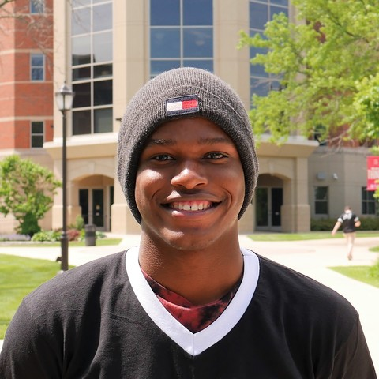
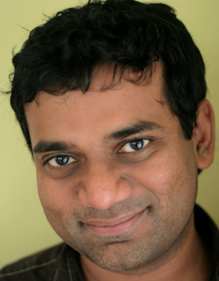

* TOC
{:toc}

## About Me
{:class="img-responsive"}

Hello all, my name is Ahmad Dinkins! I am a Junior at the University of Illinois at Urbana-Champaign and expect to graduate in 2022. I am currenlty underdeclared but I plan to transfer into Computer Science. I have had a passion for computing since entering high school and hope that my future career encompasses it. My goal for this Summer is succesffuly implement our protocol and have the State of Illinois adopt an App that uses our protocol.

## About My Mentor
{:class="img-responsive"}

Dr. Madhusudan Parthasarathy is a Computer Science Professor at the University of Illinois at Urbana-Champaign where he performs research with an emphasis on theory. Some of his research interests include Software verification, Security, Program Synthesis, and Machine Learning.

## About My Project

We want to develop an effective protocol that preserves the privacy of users in a contact tracing app. We are working a local team to develop such an app for the UIUC campus for Fall and working with companies such as Coalition to find solutions for the state of Illinois and possibly other countries. The protocols we have designed stave a class of relay attacks that no other current system can.

[My Final Report](files/finalreport.pdf)

## My Blog

[My Blog](blog.html)
